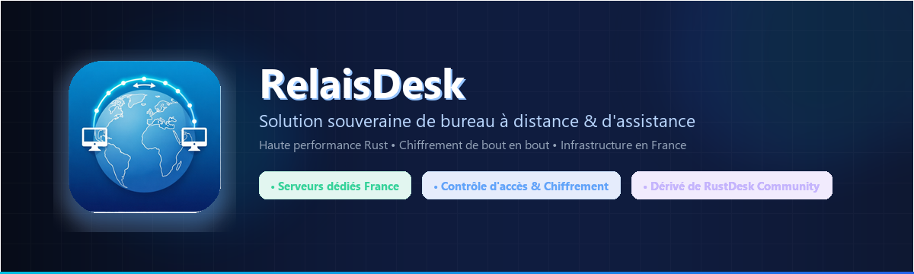
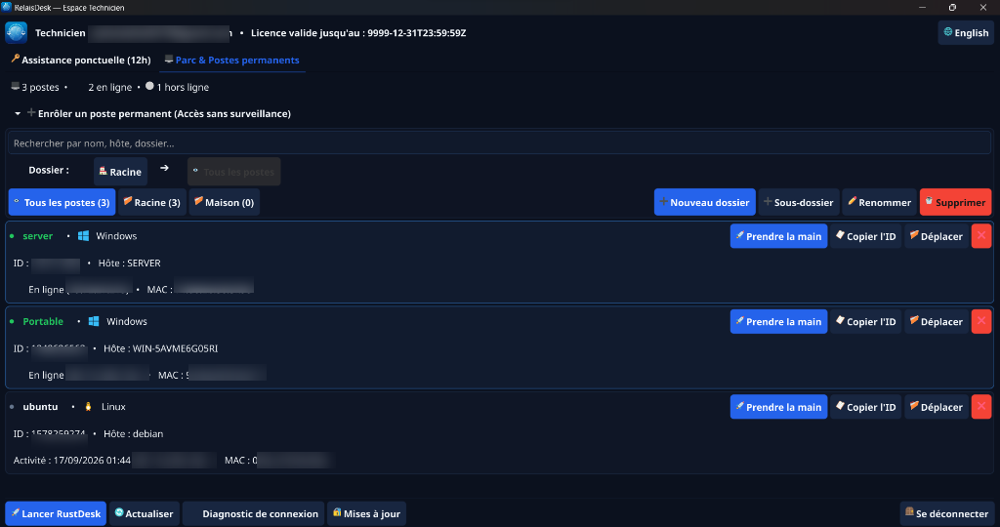
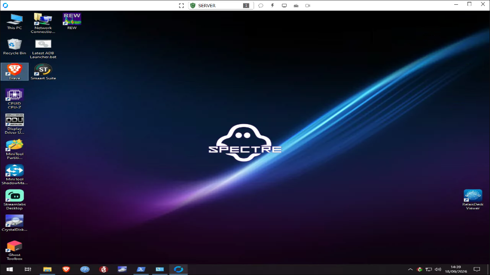

> [!IMPORTANT]
> Ce dépôt est le **fork modifié indépendant RelaisDesk** de RustDesk
> Community. Les modifications RelaisDesk sont datées du 24 août 2026 et sont maintenues par
> Julien BELLOT EI. Consultez [RELAISDESK_FORK.md](RELAISDESK_FORK.md) pour
> la notice de modification, les exigences de distribution des sources et la déclaration
> de non-affiliation. L'œuvre couverte demeure sous licence GNU AGPLv3 ; voir [LICENCE](LICENCE).

Les [instructions de compilation et de code source](docs/RELAISDESK_BUILD.md) spécifiques à RelaisDesk
et le [contact sécurité](docs/SECURITY.md) prévalent sur les exemples de distribution
amont ci-dessous. Une version amont (upstream) n'est pas une version RelaisDesk.

<p align="center">
  <br>
  <a href="#étapes-brutes-de-compilation">Compilation</a> •
  <a href="#comment-compiler-avec-docker">Docker</a> •
  <a href="#structure-des-fichiers">Structure</a> •
  <a href="#captures-décran">Captures</a><br>
  [<a href="README.md">Français</a>] | [<a href="docs/README-EN.md">English</a>] | [<a href="docs/README-ES.md">Español</a>] | [<a href="docs/README-DE.md">Deutsch</a>] | [<a href="docs/README-IT.md">Italiano</a>]<br>
  <b><a href="https://relaisdesk.fr">relaisdesk.fr</a> • Solution souveraine de bureau à distance et d'assistance informatique</b>
</p>

> [!Caution]
> **Avertissement contre toute utilisation abusive :** <br>
> Les développeurs de RelaisDesk et RustDesk ne cautionnent ni ne soutiennent aucune utilisation non éthique ou illégale de ce logiciel. Toute utilisation abusive, telle que l'accès non autorisé, le contrôle illégitime ou l'atteinte à la vie privée, est strictement contraire à nos directives. Les auteurs ne sauraient être tenus responsables d'une quelconque utilisation abusive de l'application.

[](https://relaisdesk.fr)
[](LICENCE)
[-orange)](https://relaisdesk.fr)

RelaisDesk est un client et serveur de bureau à distance souverain et indépendant, dérivé de RustDesk Community, écrit en Rust. Il intègre le protocole d'autorisation par clé propre à RelaisDesk, la vérification de l'empreinte hôte, et est configuré nativement pour une infrastructure de relais dédiée située en France.



RelaisDesk accueille avec plaisir les contributions de chacun. Consultez [CONTRIBUTING.md](docs/CONTRIBUTING.md) pour obtenir de l'aide et bien démarrer.

[**FAQ**](https://github.com/rustdesk/rustdesk/wiki/FAQ)

**Distribution RelaisDesk :** Les exécutables et paquets officiels de RelaisDesk sont distribués de manière sécurisée via la plateforme [relaisdesk.fr](https://relaisdesk.fr). Les téléchargements amonts de RustDesk sont des produits distincts et n'intègrent pas la passerelle d'autorisation RelaisDesk.

## Dépendances

Les versions de bureau utilisent Flutter ou Sciter (obsolète) pour l'interface graphique. Ce tutoriel est dédié à Sciter, étant plus simple et rapide pour débuter. Consultez notre [CI](https://github.com/rustdesk/rustdesk/blob/master/.github/workflows/flutter-build.yml) pour compiler la version Flutter.

Veuillez télécharger vous-même la bibliothèque dynamique Sciter :

[Windows](https://raw.githubusercontent.com/c-smile/sciter-sdk/master/bin.win/x64/sciter.dll) |
[Linux](https://raw.githubusercontent.com/c-smile/sciter-sdk/master/bin.lnx/x64/libsciter-gtk.so) |
[macOS](https://raw.githubusercontent.com/c-smile/sciter-sdk/master/bin.osx/libsciter.dylib)

## Étapes brutes de compilation

- Préparez votre environnement de développement Rust et vos outils de compilation C++

- Installez [vcpkg](https://github.com/microsoft/vcpkg) et configurez correctement la variable d'environnement `VCPKG_ROOT` :

  - Windows : `vcpkg install libvpx:x64-windows-static libyuv:x64-windows-static opus:x64-windows-static aom:x64-windows-static`
  - Linux/macOS : `vcpkg install libvpx libyuv opus aom`

- Lancez `cargo run`

## [Compilation](https://rustdesk.com/docs/en/dev/build/)

## Comment compiler sous Linux

### Ubuntu 18 (Debian 10)

```sh
sudo apt install -y zip g++ gcc git curl wget nasm yasm libgtk-3-dev clang libxcb-randr0-dev libxdo-dev \
        libxfixes-dev libxcb-shape0-dev libxcb-xfixes0-dev libasound2-dev libpulse-dev cmake make \
        libclang-dev ninja-build libgstreamer1.0-dev libgstreamer-plugins-base1.0-dev libpam0g-dev
```

### openSUSE Tumbleweed

```sh
sudo zypper install gcc-c++ git curl wget nasm yasm gcc gtk3-devel clang libxcb-devel libXfixes-devel cmake alsa-lib-devel gstreamer-devel gstreamer-plugins-base-devel xdotool-devel pam-devel
```

### Fedora 28 (CentOS 8)

```sh
sudo yum -y install gcc-c++ git curl wget nasm yasm gcc gtk3-devel clang libxcb-devel libxdo-devel libXfixes-devel pulseaudio-libs-devel cmake alsa-lib-devel gstreamer1-devel gstreamer1-plugins-base-devel pam-devel
```

### Arch (Manjaro)

```sh
sudo pacman -Syu --needed unzip git cmake gcc curl wget yasm nasm zip make pkg-config clang gtk3 xdotool libxcb libxfixes alsa-lib pipewire
```

### Installer vcpkg

```sh
git clone https://github.com/microsoft/vcpkg
cd vcpkg
git checkout 2023.04.15
cd ..
vcpkg/bootstrap-vcpkg.sh
export VCPKG_ROOT=$HOME/vcpkg
vcpkg/vcpkg install libvpx libyuv opus aom
```

### Corriger libvpx (Pour Fedora)

```sh
cd vcpkg/buildtrees/libvpx/src
cd *
./configure
sed -i 's/CFLAGS+=-I/CFLAGS+=-fPIC -I/g' Makefile
sed -i 's/CXXFLAGS+=-I/CXXFLAGS+=-fPIC -I/g' Makefile
make
cp libvpx.a $HOME/vcpkg/installed/x64-linux/lib/
cd
```

### Compiler

```sh
curl --proto '=https' --tlsv1.2 -sSf https://sh.rustup.rs | sh
source $HOME/.cargo/env
git clone --recurse-submodules https://github.com/rustdesk/rustdesk
cd rustdesk
mkdir -p target/debug
wget https://raw.githubusercontent.com/c-smile/sciter-sdk/master/bin.lnx/x64/libsciter-gtk.so
mv libsciter-gtk.so target/debug
VCPKG_ROOT=$HOME/vcpkg cargo run
```

## Comment compiler avec Docker

Commencez par cloner le dépôt et construire l'image Docker :

```sh
git clone https://github.com/rustdesk/rustdesk
cd rustdesk
git submodule update --init --recursive
docker build -t "rustdesk-builder" .
```

Ensuite, chaque fois que vous souhaitez compiler l'application, exécutez la commande suivante :

```sh
docker run --rm -it -v $PWD:/home/user/rustdesk -v rustdesk-git-cache:/home/user/.cargo/git -v rustdesk-registry-cache:/home/user/.cargo/registry -e PUID="$(id -u)" -e PGID="$(id -g)" rustdesk-builder
```

Notez que la première compilation peut prendre plus de temps avant que les dépendances ne soient mises en cache ; les compilations suivantes seront bien plus rapides. De plus, si vous souhaitez spécifier différents arguments pour la commande de compilation, vous pouvez le faire à la fin de la commande. Par exemple, pour compiler une version release optimisée, exécutez la commande ci-dessus suivie de `--release`. L'exécutable résultant sera disponible dans le dossier cible (`target`) sur votre système, et peut être lancé avec :

```sh
target/debug/rustdesk
```

Ou si vous exécutez un exécutable de release :

```sh
target/release/rustdesk
```

Veillez à exécuter ces commandes depuis la racine du dépôt RelaisDesk/RustDesk, sinon l'application ne pourra pas charger les ressources nécessaires. Notez également que les autres sous-commandes cargo telles que `install` ou `run` ne sont actuellement pas prises en charge via cette méthode, car elles installeraient ou exécuteraient le programme à l'intérieur du conteneur au lieu de l'hôte.

## Structure des fichiers

- **[libs/hbb_common](https://github.com/rustdesk/rustdesk/tree/master/libs/hbb_common)** : codecs vidéo, configuration, abstractions TCP/UDP, Protobuf, fonctions de système de fichiers pour le transfert de fichiers et autres fonctions utilitaires.
- **[libs/scrap](https://github.com/rustdesk/rustdesk/tree/master/libs/scrap)** : capture d'écran.
- **[libs/enigo](https://github.com/rustdesk/rustdesk/tree/master/libs/enigo)** : contrôle du clavier et de la souris selon la plateforme.
- **[libs/clipboard](https://github.com/rustdesk/rustdesk/tree/master/libs/clipboard)** : gestion du copier-coller et transfert de presse-papiers sous Windows, Linux et macOS.
- **[src/ui](https://github.com/rustdesk/rustdesk/tree/master/src/ui)** : interface Sciter historique (dépréciée).
- **[src/server](https://github.com/rustdesk/rustdesk/tree/master/src/server)** : services audio, presse-papiers, saisie utilisateur, vidéo et gestion des connexions réseau.
- **[src/client.rs](https://github.com/rustdesk/rustdesk/tree/master/src/client.rs)** : initialisation et gestion d'une connexion pair-à-pair.
- **[src/rendezvous_mediator.rs](https://github.com/rustdesk/rustdesk/tree/master/src/rendezvous_mediator.rs)** : communication avec le serveur de médiation ([rustdesk-server](https://github.com/rustdesk/rustdesk-server)), négociation de connexion directe (perforation TCP hole punching) ou relayée.
- **[src/platform](https://github.com/rustdesk/rustdesk/tree/master/src/platform)** : code propre à chaque système d'exploitation.
- **[flutter](https://github.com/rustdesk/rustdesk/tree/master/flutter)** : code Flutter pour desktop et mobile.
- **[flutter/web/js](https://github.com/rustdesk/rustdesk/tree/master/flutter/web/v1/js)** : JavaScript pour le client web Flutter.

## Captures d'écran

### Tableau de bord Technicien RelaisDesk (Gestion de parc & accès distant)


### Session de contrôle à distance en direct

